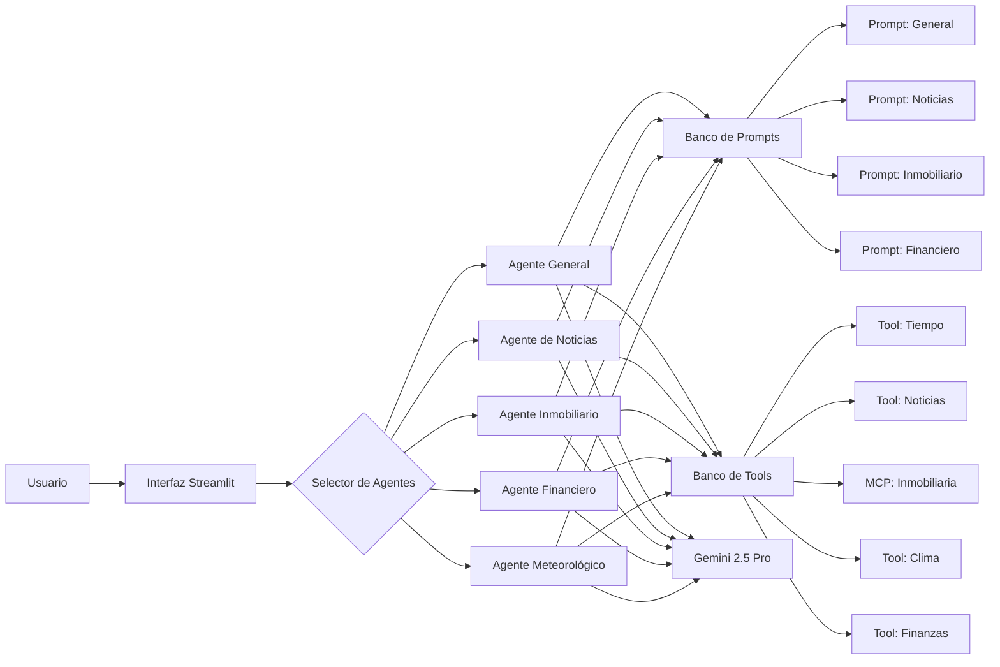

# 🤖 Basic AI Agent - Agente de IA Especializado

## 📋 Descripción del Proyecto

**Basic AI Agent** es un proyecto de desarrollo de agentes de inteligencia artificial especializados utilizando **Pydantic AI**. El objetivo principal es crear un ecosistema modular de agentes que puedan especializarse en diferentes dominios de datos regionales y funcionalidades específicas.

### 🎯 Objetivos del Proyecto

- **Agente General**: Desarrollo de un agente base con capacidades fundamentales
- **Especialización Modular**: Creación de agentes especializados por dominio
- **Banco de Prompts**: Sistema de gestión de prompts especializados
- **Banco de Tools**: Biblioteca reutilizable de herramientas
- **Interfaz Streamlit**: Interfaz web para selección de agentes especializados
- **Datos Regionales**: Enfoque en información local (Colombia)

### 🏗️ Arquitectura Planificada

## 🛠️ Estado Actual del Desarrollo

### ✅ Funcionalidades Implementadas

- **Agente Base**: Configurado con Gemini 2.5 Pro
- **Sistema de Tools**: 
  - 🕐 Obtención de fecha y hora actual
  - 📰 Scraping de noticias de El Tiempo
  - 🏠 Consulta inmobiliaria via MCP
- **Esquemas Pydantic**: Validación de entrada y salida
- **Observabilidad**: Integración con Logfire
- **Arquitectura Modular**: Separación de prompts, tools y schemas

### 🚧 En Desarrollo

- [ ] Interfaz Streamlit para selección de agentes
- [ ] Agentes especializados por dominio
- [ ] Banco de prompts dinámico
- [ ] Herramientas adicionales (clima, finanzas)
- [ ] Sistema de configuración de agentes

## 🚀 Tecnologías Utilizadas

### Core Framework
- **Pydantic AI**: Framework principal para agentes de IA
- **Google Gemini 2.5 Pro**: Modelo de lenguaje base
- **Python 3.11+**: Lenguaje de programación

### Herramientas y Servicios
- **MCP (Model Context Protocol)**: Para servicios externos
- **Playwright**: Web scraping de noticias
- **Logfire**: Observabilidad y monitoreo
- **AsyncIO**: Programación asíncrona

### Futuras Integraciones
- **Streamlit**: Interfaz de usuario web

## 🎯 Agentes Especializados Planificados

### 📰 Agente de Noticias
- Fuentes: El Tiempo, El Espectador, Semana
- Categorización automática
- Resúmenes personalizados

### 🏠 Agente Inmobiliario
- Precios de vivienda en Colombia
- Análisis de mercado regional
- Recomendaciones de inversión

### 🌤️ Agente Meteorológico
- Clima actual y pronósticos
- Alertas meteorológicas
- Datos regionales específicos

### 💰 Agente Financiero
- Precios de acciones colombianas
- Tasas de cambio COP
- Indicadores económicos

## 💡 Características Clave

- **🔧 Modularidad**: Arquitectura basada en componentes reutilizables
- **🌎 Datos Regionales**: Enfoque en información colombiana
- **🔄 Asíncrono**: Operaciones no bloqueantes
- **📊 Observabilidad**: Monitoreo completo con Logfire
- **🛡️ Validación**: Esquemas Pydantic para datos seguros
- **🎨 Interfaz Futura**: Streamlit para experiencia de usuario

## 🚦 Roadmap

### Fase 1: Base (Actual) ✅
- [x] Agente general funcional
- [x] Herramientas básicas (tiempo, noticias, inmobiliaria)
- [x] Arquitectura modular

### Fase 2: Especialización 🚧
- [ ] Agentes especializados por dominio
- [ ] Banco de prompts dinámico
- [ ] Más herramientas regionales

### Fase 3: Interfaz 🔮
- [ ] Interfaz Streamlit
- [ ] Selector de agentes
- [ ] Dashboard de monitoreo

### Fase 4: Escalabilidad 🔮
- [ ] Base de datos persistente
- [ ] Cache distribuido
- [ ] API REST completa

