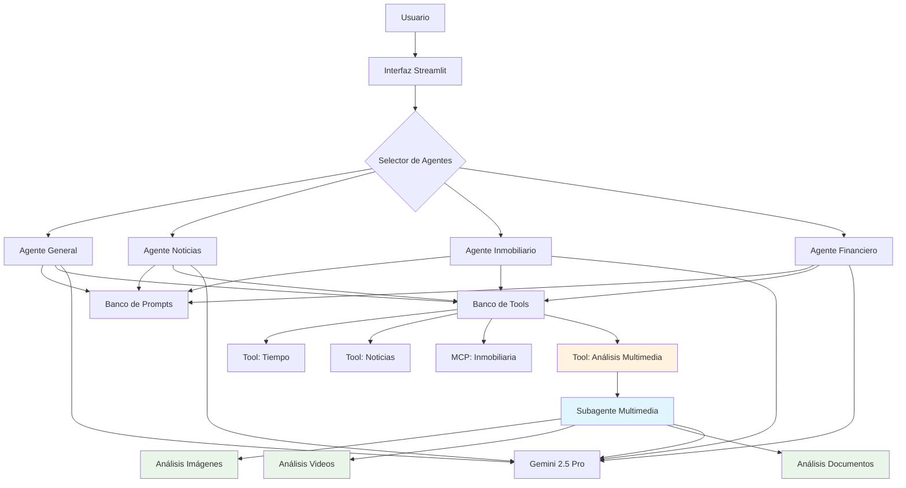
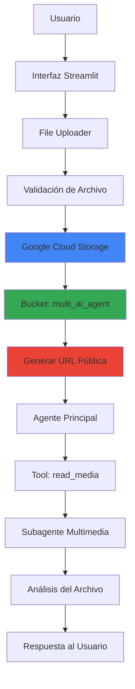
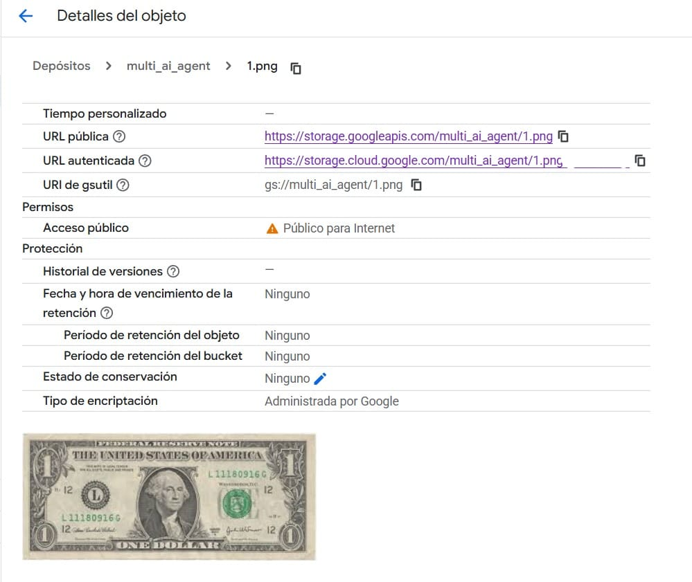
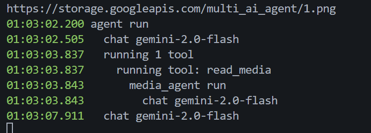
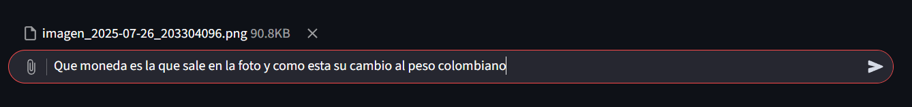
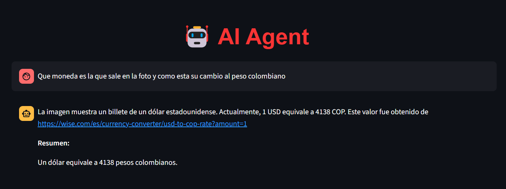
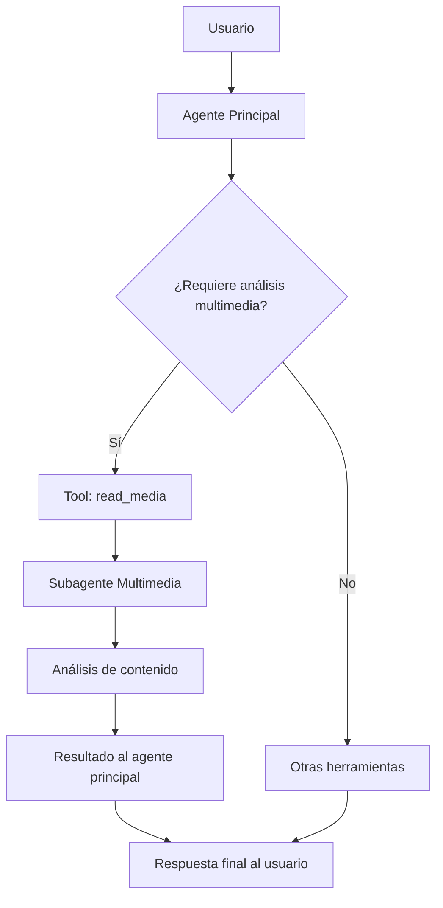
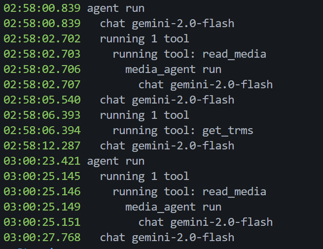

# 🤖 Basic AI Agent - Agente de IA Especializado

[](https://python.org)
[](https://ai.pydantic.dev)
[](https://ai.google.dev)
[](https://modelcontextprotocol.io)

[](https://streamlit.io)
[](https://playwright.dev)
[](https://fastapi.tiangolo.com)
[](https://cloud.google.com/storage)

[](https://cloud.google.com)
[](https://pydantic.dev/logfire)
[](https://pypi.org/project/python-dotenv/)

## 📋 Descripción del Proyecto

**Basic AI Agent** es un proyecto de desarrollo de agentes de inteligencia artificial especializados utilizando **Pydantic AI**. El objetivo principal es crear un ecosistema modular de agentes que puedan especializarse en diferentes dominios de datos regionales y funcionalidades específicas.

### 🎯 Objetivos del Proyecto

- **Agente General**: Desarrollo de un agente base con capacidades fundamentales
- **Especialización Modular**: Creación de agentes especializados por dominio
- **Banco de Prompts**: Sistema de gestión de prompts especializados
- **Banco de Tools**: Biblioteca reutilizable de herramientas
- **Interfaz Streamlit**: Interfaz web para selección de agentes especializados
- **Datos Regionales**: Enfoque en información local (Colombia)

### 🏗️ Arquitectura Planificada



## 🧠 Gestión Inteligente de Contexto

Una de las características principales de este agente es su **ventana de contexto dinámico** que permite controlar cuántos mensajes anteriores recuerda el agente. Esto es crucial para optimizar tanto el rendimiento como los costos de tokens.

### 🎛️ Ventana de Contexto Dinámico


El agente cuenta con un control deslizante que permite ajustar la ventana de contexto en tiempo real:

- **Rango**: 1-20 mensajes anteriores
- **Valor por defecto**: 6 mensajes
- **Impacto**: A mayor contexto, mayor consumo de tokens y costo

**⚠️ Importante**: Una ventana de contexto mayor significa más tokens enviados al modelo, lo que incrementa el costo por consulta.

### 💻 Implementación del Manejo de Historia

#### Ejemplo Básico - Solo Último Mensaje
```python
import asyncio
from agent_model import test_agent

async def chat_with_history():
    """ Función para mantener el contexto del mensaje anterior"""
    
    history = [] # Definimos la lista para guardar los mensajes
    
    print("Si desea salir escriba 'salir','s' o 'q'")
    # Creamos el bucle
    async with test_agent.run_mcp_servers():
        while True:
            user_input = input("User: ") # Entrada del usuario
            if user_input.lower() in {"salir","s","q"}: # Validamos si quiere salir
                break
            # Preguntamos al modelo
            result = await test_agent.run(user_input, message_history=history)
            print(f"Agent: {result.output}") # Obtenemos la respuesta
            
            history = result.new_messages() # Agregamos el mensaje al historial
            # Nota: el agente solo tendrá contexto del último mensaje
        
if __name__ == "__main__":
    asyncio.run(chat_with_history())
```

#### Opciones de Manejo de Historia

**Para obtener TODO el historial:**
```python
history = result.all_messages()  # Mantiene todos los mensajes
```

**Para una ventana de contexto personalizada (implementación en app.py):**
```python
# Numero de mensajes que recuerda
contexto = 6 

# Ventana de contexto dinámico
MAX_HISTORY = (contexto * 3) + 1

# Obtenemos todo el historial acumulado
all_msgs = result.all_messages()

# Recortamos los últimos N mensajes usando slicing
trimmed_history = all_msgs[-MAX_HISTORY:]

# Actualizamos el historial
history = trimmed_history

```

### 📝 **Explicación de la Fórmula `MAX_HISTORY`**

La fórmula `MAX_HISTORY = (contexto * 3) + 1` se basa en cómo **Pydantic AI** estructura internamente los mensajes:

#### 🔍 **Anatomía de un Intercambio en Pydantic AI:**

Para cada interacción usuario-agente, Pydantic AI genera **3 mensajes**:
1. **Mensaje del Usuario** 📝 - La pregunta o solicitud
2. **Llamada a Herramientas** 🛠️ - Si el agente usa tools (tiempo, noticias, MCP, etc.)
3. **Respuesta del Agente** 🤖 - La respuesta final procesada

#### 🧮 **Desglose del Cálculo:**
- **`contexto * 3`**: Multiplica por 3 para incluir los 3 tipos de mensaje por cada intercambio
- **`+ 1`**: Suma 1 para incluir el **System Prompt** inicial que establece las instrucciones base del agente

#### 💡 **Ejemplo Práctico:**
```
contexto = 6 mensajes anteriores
MAX_HISTORY = (6 * 3) + 1 = 19 mensajes totales

Distribución:
- 1 System Prompt inicial
- 18 mensajes de 6 intercambios (6 × 3)
  • 6 preguntas del usuario
  • 6 llamadas a herramientas  
  • 6 respuestas del agente
```

Esta estructura garantiza que el agente mantenga el contexto completo de las conversaciones anteriores sin perder información crucial sobre las herramientas utilizadas en cada intercambio.

### 🔄 Beneficios del Sistema de Contexto

- **💰 Control de Costos**: Ajusta el consumo de tokens según necesidades
- **⚡ Performance**: Menor contexto = respuestas más rápidas
- **🎯 Relevancia**: Mantiene solo información contextual relevante
- **🔧 Flexibilidad**: Configuración dinámica durante la conversación

## 📁 Sistema de Gestión de Archivos con GCP Storage

El proyecto incluye una **funcionalidad avanzada de gestión de archivos** que permite a los usuarios subir archivos directamente a **Google Cloud Storage** y generar URLs públicas para que los agentes especializados puedan analizarlos. Esta implementación elimina las limitaciones de tamaño y permite un procesamiento más eficiente de contenido multimedia.

### 🔧 Arquitectura de Subida de Archivos



### 📸 Proceso Visual de Subida y Análisis

<div align="center">

| Archivo en GCP | Generación de URL |
|:-------------:|:----------------:|
|  |  |

</div>



<div align="center">

| Respuesta del Agente |
|:-------------------:|
|  |

</div>

### 💻 Implementación GCP Storage

```python
import os
from dotenv import load_dotenv
from google.cloud import storage
from google.cloud.exceptions import NotFound

load_dotenv()

json_gcp = os.getenv("JSON_GCP")
client = storage.Client.from_service_account_json(json_gcp)

def save_in_bucket(file_name:str ,file: any ,bucket_name:str ="multi_ai_agent"):
    try: 
        bucket = client.get_bucket(bucket_name)
    except NotFound as e:
        raise RuntimeError(f"Bucket {bucket_name} no encontrado : {e}")
    
    blob = bucket.blob(file_name)
    blob.upload_from_file(file, content_type=file.type)
    blob.make_public()
    
    return blob.public_url

def drop_file(file_name: str, bucket_name:str ="multi_ai_agent"):
    try: 
        bucket = client.get_bucket(bucket_name)
    except NotFound as e:
        raise RuntimeError(f"Bucket {bucket_name} no encontrado : {e}")
    
    blob = bucket.blob(file_name)
    
    if not blob.exists():
        return {"status": False, "message": f"Archivo no existe: {file_name}"}
    
    blob.delete()
    return True
```

### 🚀 Características del Sistema de Archivos

- **☁️ Almacenamiento en la Nube**: Integración directa con Google Cloud Storage
- **🔗 URLs Públicas**: Generación automática de enlaces públicos accesibles
- **🗑️ Gestión Completa**: Funciones de subida y eliminación de archivos
- **🔒 Seguridad**: Manejo de credenciales mediante variables de entorno
- **🎯 Integración Directa**: Los agentes pueden acceder inmediatamente al contenido

### 📋 Formatos de Archivo Soportados

| Categoría | Formatos | Capacidades |
|-----------|----------|-------------|
| **📷 Imágenes** | JPG, PNG, GIF, WebP | Análisis visual, OCR, detección de objetos |
| **🎥 Videos** | MP4, AVI, MOV, WebM | Análisis de contenido, transcripción |
| **📄 Documentos** | PDF, DOC, DOCX, TXT | Extracción de texto, análisis de contenido |

## 🎯 Sistema de Delegación de Tareas con Subagentes

Una de las características más avanzadas del proyecto es la **integración de delegación de tareas** que permite a Pydantic AI crear subagentes especializados para tareas específicas. En este caso, se ha implementado un **agente de análisis multimedia** que funciona como herramienta delegada.

### 🔧 Arquitectura de Delegación


El sistema funciona con la siguiente arquitectura:



### 🎥 Implementación del Subagente Multimedia

#### Definición del Subagente Especializado

```python
# Agente especializado en análisis multimedia
media_agent = Agent(
    model=model_config(),
    system_prompt="""
    Eres un agente encargado de analizar URLs y responder en base a las preguntas, 
    puedes recibir URLs de imagen, video o documento; debes analizarlas y responder con precisión.
    """,
    output_type=ResponseBase
)

# Función que actúa como herramienta delegada
async def read_media(question: str,
                    media_url: str,
                    type_file: Literal["imagen","video","documento"]) -> str:
    """
    Función para analizar archivos multimedia: imágenes, videos o documentos.
    
    Parámetros:
    - question: Pregunta a realizar sobre el archivo
    - media_url: URL pública del archivo a analizar
    - type_file: Tipo de archivo ("imagen", "video", "documento")
    
    Retorna:
    - Respuesta generada por el subagente especializado
    """
    media_type = type_map.get(type_file)
    response = await media_agent.run([question, media_type(media_url)])
    return response.output.response

# Herramienta que encapsula el subagente
read_media_tool = Tool(
    function=read_media,
    name="read_media",
    description="Tool especializada en análisis multimodal (imagen, video, documento) desde URLs públicas.",
    max_retries=3
)
```

### 🏗️ Integración en Agentes Especializados

Todos los agentes especializados incluyen la capacidad de delegación multimedia:

```python
def agent_noticias(model) -> Agent:
    return Agent(
        model=model,
        system_prompt=NOTICIAS_SYSTEM_PROMPT,
        tools=[get_time_now_tool, get_news_tool, read_media_tool],  # ← Delegación incluida
        retries=True,
        instrument=True
    )

def agent_inmobiliario(model) -> Agent:
    return Agent(
        model=model,
        system_prompt=INMOBILIARIO_SYSTEM_PROMPT,
        tools=[read_media_tool],  # ← Capacidad multimedia
        mcp_servers=[inmopipeline_mcp],
        retries=2,
        instrument=True
    )
```

### 💻 Flujo de Ejecución en Terminal



El flujo de delegación se ejecuta de la siguiente manera:

1. **👤 Usuario**: Solicita análisis de una imagen, video o documento mediante URL
2. **🤖 Agente Principal**: Identifica que necesita análisis multimedia
3. **🔧 Herramienta read_media**: Se activa automáticamente como delegación
4. **🎯 Subagente Multimedia**: Procesa el contenido específico
5. **📊 Análisis Especializado**: Genera respuesta enfocada en el contenido multimedia
6. **🔄 Retorno**: El resultado se integra en la respuesta del agente principal
7. **💬 Respuesta Unificada**: El usuario recibe una respuesta coherente que combina el análisis multimedia con el contexto de la conversación

### 🎭 Capacidades Multimodales Soportadas

| Tipo de Archivo | Formato Pydantic AI | Capacidades de Análisis |
|-----------------|-------------------|------------------------|
| **📷 Imágenes** | `ImageUrl` | Descripción, OCR, detección de objetos, análisis visual |
| **🎥 Videos** | `VideoUrl` | Análisis de contenido, transcripción, detección de escenas |
| **📄 Documentos** | `DocumentUrl` | Extracción de texto, análisis de contenido, resumen |

### 💡 Ventajas de la Delegación de Tareas

- **🎯 Especialización**: Cada subagente se enfoca en una tarea específica
- **🔄 Reutilización**: La herramienta multimedia puede ser usada por cualquier agente
- **⚡ Eficiencia**: Procesamiento optimizado según el tipo de contenido
- **🛡️ Modularidad**: Fácil mantenimiento y escalabilidad del sistema
- **🧠 Inteligencia Distribuida**: División lógica de responsabilidades

### 🚀 Casos de Uso Prácticos

- **📰 Agente de Noticias**: Analiza imágenes de noticias, capturas de pantalla de artículos
- **🏠 Agente Inmobiliario**: Examina fotos de propiedades, planos, documentos legales
- **🌤️ Agente Meteorológico**: Interpreta mapas climáticos, gráficos meteorológicos
- **💰 Agente Financiero**: Analiza gráficos de bolsa, reportes financieros, tablas de datos

Esta implementación demuestra cómo **Pydantic AI** facilita la creación de sistemas de IA colaborativos donde diferentes agentes pueden especializarse y trabajar en conjunto para resolver tareas complejas de manera eficiente.

## 🛠️ Estado Actual del Desarrollo

### ✅ Funcionalidades Implementadas

- **Agente Base**: Configurado con Gemini 2.5 Pro
- **Sistema de Delegación**: Subagentes especializados como herramientas
- **Gestión de Archivos GCP**: Subida automática a Google Cloud Storage con URLs públicas
- **Análisis Multimedia**: Procesamiento de imágenes, videos y documentos via URL
- **Sistema de Tools**: 
  - 🕐 Obtención de fecha y hora actual
  - 📰 Scraping de noticias de El Tiempo
  - 🏠 Consulta inmobiliaria via MCP
  - 🎥 Análisis multimodal (delegación a subagente especializado)
  - 📁 Gestión de archivos en la nube (subida/eliminación)
- **Esquemas Pydantic**: Validación de entrada y salida
- **Observabilidad**: Integración con Logfire
- **Arquitectura Modular**: Separación de prompts, tools y schemas
- **Interfaz Streamlit**: Selección de agentes, gestión de archivos y configuración de rendimiento
- **Gestión de Contexto**: Ventana dinámica de historia de conversación

### 🚧 En Desarrollo

- [ ] Agentes especializados por dominio
- [ ] Banco de prompts dinámico
- [ ] Herramientas adicionales (clima, finanzas)
- [ ] Sistema de configuración de agentes

## 🚀 Tecnologías Utilizadas

### Core Framework
- **Pydantic AI**: Framework principal para agentes de IA
- **Google Gemini 2.5 Pro**: Modelo de lenguaje base
- **Python 3.11+**: Lenguaje de programación

### Herramientas y Servicios
- **MCP (Model Context Protocol)**: Para servicios externos
- **Playwright**: Web scraping de noticias
- **Logfire**: Observabilidad y monitoreo
- **AsyncIO**: Programación asíncrona
- **Google Cloud Storage**: Almacenamiento de archivos en la nube

### Futuras Integraciones
- **Streamlit**: Interfaz de usuario web

## 🎯 Agentes Especializados Planificados

### 📰 Agente de Noticias
- Fuentes: El Tiempo, El Espectador, Semana
- Categorización automática
- Resúmenes personalizados

### 🏠 Agente Inmobiliario
- Precios de vivienda en Colombia
- Análisis de mercado regional
- Recomendaciones de inversión

### 🌤️ Agente Meteorológico
- Clima actual y pronósticos
- Alertas meteorológicas
- Datos regionales específicos

### 💰 Agente Financiero
- Precios de acciones colombianas
- Tasas de cambio COP
- Indicadores económicos

## 💡 Características Clave

- **🔧 Modularidad**: Arquitectura basada en componentes reutilizables
- **🎯 Delegación Inteligente**: Subagentes especializados como herramientas
- **📁 Gestión de Archivos en la Nube**: Subida automática a GCP Storage con URLs públicas
- **🎥 Análisis Multimodal**: Procesamiento de imágenes, videos y documentos
- **🌎 Datos Regionales**: Enfoque en información colombiana
- **🔄 Asíncrono**: Operaciones no bloqueantes
- **📊 Observabilidad**: Monitoreo completo con Logfire
- **🛡️ Validación**: Esquemas Pydantic para datos seguros
- **🧠 Gestión de Contexto**: Control dinámico de historia conversacional
- **🎨 Interfaz Completa**: Streamlit con capacidades de file upload

## 🚦 Roadmap

### Fase 1: Base (Actual) ✅
- [x] Agente general funcional
- [x] Herramientas básicas (tiempo, noticias, inmobiliaria)
- [x] Arquitectura modular

### Fase 2: Especialización 🚧
- [ ] Agentes especializados por dominio
- [ ] Banco de prompts dinámico
- [ ] Más herramientas regionales

### Fase 3: Interfaz 🔮
- [ ] Interfaz Streamlit
- [ ] Selector de agentes
- [ ] Dashboard de monitoreo

### Fase 4: Escalabilidad 🔮
- [ ] Base de datos persistente
- [ ] Cache distribuido
- [ ] API REST completa
