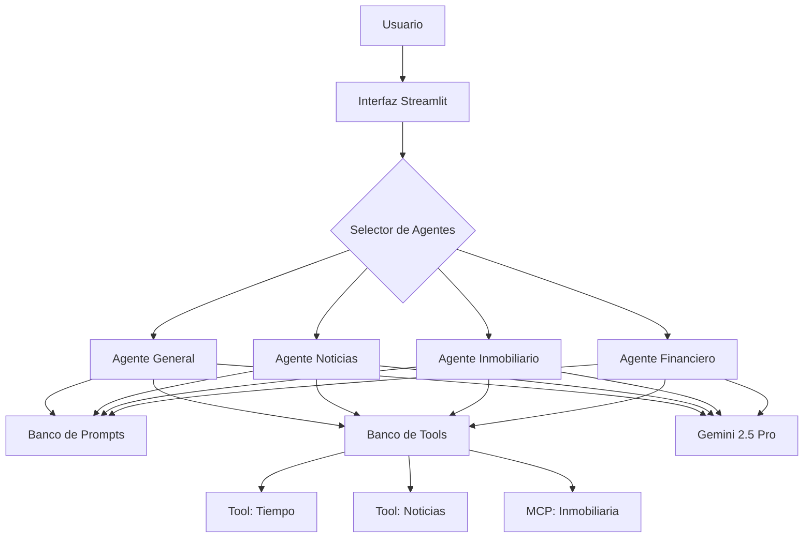

# 🤖 Basic AI Agent - Agente de IA Especializado

[](https://python.org)
[](https://ai.pydantic.dev)
[](https://ai.google.dev)
[](https://modelcontextprotocol.io)

[](https://streamlit.io)
[](https://playwright.dev)
[](https://fastapi.tiangolo.com)
[](https://pydantic.dev/logfire)

## 📋 Descripción del Proyecto

**Basic AI Agent** es un proyecto de desarrollo de agentes de inteligencia artificial especializados utilizando **Pydantic AI**. El objetivo principal es crear un ecosistema modular de agentes que puedan especializarse en diferentes dominios de datos regionales y funcionalidades específicas.

### 🎯 Objetivos del Proyecto

- **Agente General**: Desarrollo de un agente base con capacidades fundamentales
- **Especialización Modular**: Creación de agentes especializados por dominio
- **Banco de Prompts**: Sistema de gestión de prompts especializados
- **Banco de Tools**: Biblioteca reutilizable de herramientas
- **Interfaz Streamlit**: Interfaz web para selección de agentes especializados
- **Datos Regionales**: Enfoque en información local (Colombia)

### 🏗️ Arquitectura Planificada



## 🧠 Gestión Inteligente de Contexto

Una de las características principales de este agente es su **ventana de contexto dinámico** que permite controlar cuántos mensajes anteriores recuerda el agente. Esto es crucial para optimizar tanto el rendimiento como los costos de tokens.

### 🎛️ Ventana de Contexto Dinámico


El agente cuenta con un control deslizante que permite ajustar la ventana de contexto en tiempo real:

- **Rango**: 1-20 mensajes anteriores
- **Valor por defecto**: 6 mensajes
- **Impacto**: A mayor contexto, mayor consumo de tokens y costo

**⚠️ Importante**: Una ventana de contexto mayor significa más tokens enviados al modelo, lo que incrementa el costo por consulta.

### 💻 Implementación del Manejo de Historia

#### Ejemplo Básico - Solo Último Mensaje
```python
import asyncio
from agent_model import test_agent

async def chat_with_history():
    """ Función para mantener el contexto del mensaje anterior"""
    
    history = [] # Definimos la lista para guardar los mensajes
    
    print("Si desea salir escriba 'salir','s' o 'q'")
    # Creamos el bucle
    async with test_agent.run_mcp_servers():
        while True:
            user_input = input("User: ") # Entrada del usuario
            if user_input.lower() in {"salir","s","q"}: # Validamos si quiere salir
                break
            # Preguntamos al modelo
            result = await test_agent.run(user_input, message_history=history)
            print(f"Agent: {result.output}") # Obtenemos la respuesta
            
            history = result.new_messages() # Agregamos el mensaje al historial
            # Nota: el agente solo tendrá contexto del último mensaje
        
if __name__ == "__main__":
    asyncio.run(chat_with_history())
```

#### Opciones de Manejo de Historia

**Para obtener TODO el historial:**
```python
history = result.all_messages()  # Mantiene todos los mensajes
```

**Para una ventana de contexto personalizada (implementación en app.py):**
```python
# Numero de mensajes que recuerda
contexto = 6 

# Ventana de contexto dinámico
MAX_HISTORY = (contexto * 3) + 1

# Obtenemos todo el historial acumulado
all_msgs = result.all_messages()

# Recortamos los últimos N mensajes usando slicing
trimmed_history = all_msgs[-MAX_HISTORY:]

# Actualizamos el historial
history = trimmed_history

```

### 📝 **Explicación de la Fórmula `MAX_HISTORY`**

La fórmula `MAX_HISTORY = (contexto * 3) + 1` se basa en cómo **Pydantic AI** estructura internamente los mensajes:

#### 🔍 **Anatomía de un Intercambio en Pydantic AI:**

Para cada interacción usuario-agente, Pydantic AI genera **3 mensajes**:
1. **Mensaje del Usuario** 📝 - La pregunta o solicitud
2. **Llamada a Herramientas** 🛠️ - Si el agente usa tools (tiempo, noticias, MCP, etc.)
3. **Respuesta del Agente** 🤖 - La respuesta final procesada

#### 🧮 **Desglose del Cálculo:**
- **`contexto * 3`**: Multiplica por 3 para incluir los 3 tipos de mensaje por cada intercambio
- **`+ 1`**: Suma 1 para incluir el **System Prompt** inicial que establece las instrucciones base del agente

#### 💡 **Ejemplo Práctico:**
```
contexto = 6 mensajes anteriores
MAX_HISTORY = (6 * 3) + 1 = 19 mensajes totales

Distribución:
- 1 System Prompt inicial
- 18 mensajes de 6 intercambios (6 × 3)
  • 6 preguntas del usuario
  • 6 llamadas a herramientas  
  • 6 respuestas del agente
```

Esta estructura garantiza que el agente mantenga el contexto completo de las conversaciones anteriores sin perder información crucial sobre las herramientas utilizadas en cada intercambio.

### 🔄 Beneficios del Sistema de Contexto

- **💰 Control de Costos**: Ajusta el consumo de tokens según necesidades
- **⚡ Performance**: Menor contexto = respuestas más rápidas
- **🎯 Relevancia**: Mantiene solo información contextual relevante
- **🔧 Flexibilidad**: Configuración dinámica durante la conversación

## 🛠️ Estado Actual del Desarrollo

### ✅ Funcionalidades Implementadas

- **Agente Base**: Configurado con Gemini 2.5 Pro
- **Sistema de Tools**: 
  - 🕐 Obtención de fecha y hora actual
  - 📰 Scraping de noticias de El Tiempo
  - 🏠 Consulta inmobiliaria via MCP
- **Esquemas Pydantic**: Validación de entrada y salida
- **Observabilidad**: Integración con Logfire
- **Arquitectura Modular**: Separación de prompts, tools y schemas
- **Interfaz Streamlit**: Selección de agentes y configurar rendimiento
### 🚧 En Desarrollo

- [ ] Agentes especializados por dominio
- [ ] Banco de prompts dinámico
- [ ] Herramientas adicionales (clima, finanzas)
- [ ] Sistema de configuración de agentes

## 🚀 Tecnologías Utilizadas

### Core Framework
- **Pydantic AI**: Framework principal para agentes de IA
- **Google Gemini 2.5 Pro**: Modelo de lenguaje base
- **Python 3.11+**: Lenguaje de programación

### Herramientas y Servicios
- **MCP (Model Context Protocol)**: Para servicios externos
- **Playwright**: Web scraping de noticias
- **Logfire**: Observabilidad y monitoreo
- **AsyncIO**: Programación asíncrona

### Futuras Integraciones
- **Streamlit**: Interfaz de usuario web

## 🎯 Agentes Especializados Planificados

### 📰 Agente de Noticias
- Fuentes: El Tiempo, El Espectador, Semana
- Categorización automática
- Resúmenes personalizados

### 🏠 Agente Inmobiliario
- Precios de vivienda en Colombia
- Análisis de mercado regional
- Recomendaciones de inversión

### 🌤️ Agente Meteorológico
- Clima actual y pronósticos
- Alertas meteorológicas
- Datos regionales específicos

### 💰 Agente Financiero
- Precios de acciones colombianas
- Tasas de cambio COP
- Indicadores económicos

## 💡 Características Clave

- **🔧 Modularidad**: Arquitectura basada en componentes reutilizables
- **🌎 Datos Regionales**: Enfoque en información colombiana
- **🔄 Asíncrono**: Operaciones no bloqueantes
- **📊 Observabilidad**: Monitoreo completo con Logfire
- **🛡️ Validación**: Esquemas Pydantic para datos seguros
- **🎨 Interfaz Futura**: Streamlit para experiencia de usuario

## 🚦 Roadmap

### Fase 1: Base (Actual) ✅
- [x] Agente general funcional
- [x] Herramientas básicas (tiempo, noticias, inmobiliaria)
- [x] Arquitectura modular

### Fase 2: Especialización 🚧
- [ ] Agentes especializados por dominio
- [ ] Banco de prompts dinámico
- [ ] Más herramientas regionales

### Fase 3: Interfaz 🔮
- [ ] Interfaz Streamlit
- [ ] Selector de agentes
- [ ] Dashboard de monitoreo

### Fase 4: Escalabilidad 🔮
- [ ] Base de datos persistente
- [ ] Cache distribuido
- [ ] API REST completa

